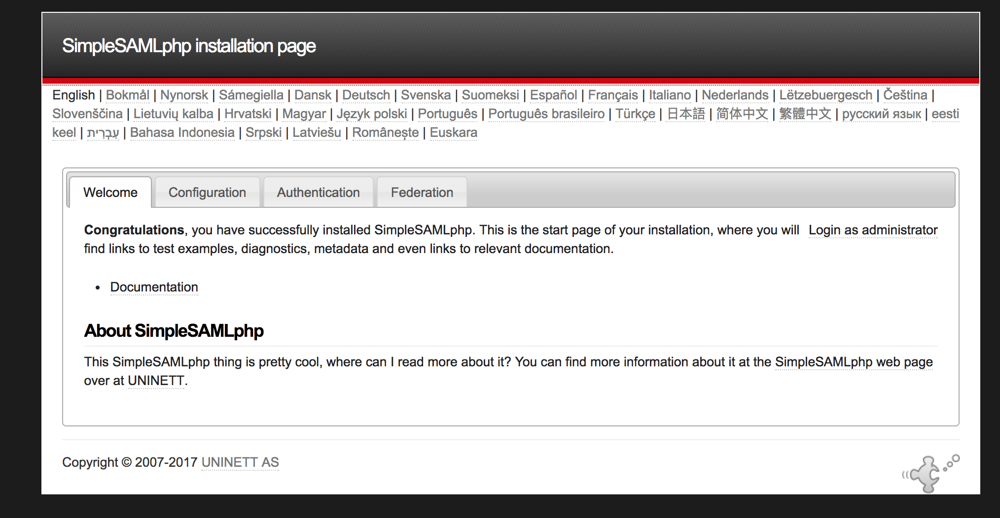
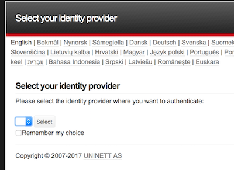

<!-- START doctoc generated TOC please keep comment here to allow auto update -->
<!-- DON'T EDIT THIS SECTION, INSTEAD RE-RUN doctoc TO UPDATE -->
**Table of Contents**  *generated with [DocToc](https://github.com/thlorenz/doctoc)*

- [Setting up an SP](#setting-up-an-sp)
  - [Answers](#answers)
- [Run a container](#run-a-container)
- [Configure It](#configure-it)
  - [Changing config.php](#changing-configphp)
  - [Log In](#log-in)
  - [Metadata](#metadata)
  - [Log In (for real)](#log-in-for-real)
- [Summary](#summary)

<!-- END doctoc generated TOC please keep comment here to allow auto update -->


# Setting up an SP

In this tutorial we are going to setup a SAML service provider and get a feel for the layout of SSP.

## Answers

We'll be using `sp` folder for the intial configuration and having you
adjust the files during the tutorial. The `sp-setup` folder contains configuration files that
have already been adjusted. You can reference those if you get stuck.


# Run a container

We are going to run a container for the service `https://service.tutorial.stack-dev.cirrusidentity.com`
and mount some configuration files.

## macOs/Linux

```bash
cd <git checkout>
FOLDER=sp
docker run -d --name service-provider \
  -e VIRTUAL_PORT=443 \
  -e VIRTUAL_PROTO=https \
  -e VIRTUAL_HOST=service.tutorial.stack-dev.cirrusidentity.com \
  -v $PWD/1_SP_Setup/$FOLDER/config:/var/simplesamlphp/config \
  -v $PWD/1_SP_Setup/$FOLDER/metadata:/var/simplesamlphp/metadata \
  -v $PWD/1_SP_Setup/cert:/var/simplesamlphp/cert \
  cirrusid/ssp-base:1.14.16
```

## Windows

```bash
cd <git checkout>
set PWD=/c/Users/<current_user>/<path_to_tutorial_check_out>
set FOLDER=sp
docker run -d --name service-provider ^
  -e VIRTUAL_PORT=443 ^
  -e VIRTUAL_PROTO=https ^
  -e VIRTUAL_HOST=service.tutorial.stack-dev.cirrusidentity.com ^
  -v %PWD%/1_SP_Setup/%FOLDER%/config:/var/simplesamlphp/config ^
  -v %PWD%/1_SP_Setup/%FOLDER%/metadata:/var/simplesamlphp/metadata ^
  -v %PWD%/1_SP_Setup/cert:/var/simplesamlphp/cert ^
  cirrusid/ssp-base:1.14.16
```

and you can now access the site

https://service.tutorial.stack-dev.cirrusidentity.com/simplesaml/

and see something like



# Configure It

Now that we have an SSP running we'll configure it as an SP and login to it through an IDP

The [SSP documentation](https://simplesamlphp.org/docs/stable) is fairly thorough. However to aid in creating a smooth tutorial we've already done several steps for you.

## Changing config.php

You'll want to change several settings in `config.php` to lock things down.

In your favorite editor edit `sp/config/config.php` and change 

* `showerrors`
* `auth.adminpassword`
* `admin.protectindexpage`
* `secretsalt`
* `session.cookie.secure`

The comments in `config.php` will provide hints. Once you save your changes are live. No need to restart anything

## Log In

If you are in the admin interface you can browse to [Federation
tab](https://service.tutorial.stack-dev.cirrusidentity.com/simplesaml/module.php/core/frontpage_federation.php)
and see that your the SSP instance already has a SP configured.

Where is that SP configured? If you look in `sp/config/authsources.php` you'll find out.

```php
    // An authentication source which can authenticate against both SAML 2.0
    // and Shibboleth 1.3 IdPs.
    'default-sp' => array(
        'saml:SP',
        //various options
       //....
     )
```

This is the `default-sp` authentication source which is of type
`saml:SP` which makes it a service provider. If you are accustom to
Shibboleth SP you may be expecting a Web Access Management approach
where you define which paths or folders are protected. SSP takes a
different approach where your app can trigger authentication by
calling the correct SSP libraries.

There are a few changes we'll need to make to `authsources.php`.
We'll want to enable SHA-256 signatures for `signature.algorithm` and
enable certs (`privatekey` and `certificate`).

If you aren't writing code you can trigger an authentication attempt
by visiting the Authentication tab and [testing auth
sources](https://service.tutorial.stack-dev.cirrusidentity.com/simplesaml/module.php/core/authenticate.php). Let's
do that now and select `default-sp` and you should see the default
discovery page as shown below.



No IdPs are listed because the SP doesn't have the metadata for any IdPs.

## Metadata

We'll add some IdP SAML metadata to the SP to let us authenticate. For simplicity we'll add metadata in SSP's php format, but in a later part of the tutorial we'll use the `metarefresh` module to do periodic fetching, validation and processing of a metadata aggregate (such as the InCommon aggregate).

We've already registerd the tutorial SP with the IdPs in the below table.
To incorporate the metadata in you SP, do:

1. Create a `php` metadta file for the idps in `sp/metadata/saml20-idp-remote.php`
   1. `echo -e '<?php \n' > sp/metadata/saml20-idp-remote.php` (For Windows, just use a text editor to create the metadata file).
1. For each IdP:
   1. Download the metadata to your machine.
   2. Goto SSP's [metadata converter](https://service.tutorial.stack-dev.cirrusidentity.com/simplesaml/admin/metadata-converter.php)
   3. Click `Browse...` and pick the metadata file you downloaded and then click `parse`.
   4. Below you'll see the `Converted metadata` section. Go to the section labeled `saml20-idp-remote` and copy the data
   5. Paste the data into `sp/metadata/saml20-idp-remote.php`
1. Visit the SSP [Federation UI](https://service.tutorial.stack-dev.cirrusidentity.com/simplesaml/module.php/core/frontpage_federation.php) and confirm you see the IdPs listed.

| IdP | Metadata Link |
| --- | --- | 
| Test Shib | https://www.testshib.org/metadata/testshib-providers.xml |
| Okta Dev | http://idp.oktadev.com/metadata |


## Log In (for real)

[Test the authentication source](https://service.tutorial.stack-dev.cirrusidentity.com/simplesaml/module.php/core/authenticate.php?as=default-sp) and you should be able to pick from the IdPs you've added.

| IdP | Login Notes |
| --- | --- |
| Test Shib | Username and passwords are on the login screen |
| Okta Dev | You need to provide the data to be asserted as shown below |


Okta Settings. 

-  **Issuer:** urn:example:idp
-  **SP ACS URL:** https://service.tutorial.stack-dev.cirrusidentity.com/simplesaml/module.php/saml/sp/saml2-acs.php/default-sp
-  **SP Audience URI:** https://service.tutorial.stack-dev.cirrusidentity.com/simplesaml/module.php/saml/sp/metadata.php/default-sp


# Summary

You've learned about setting up a service provider, adding metadata and testing authentication.
In the next section you'll configure an IdP.
