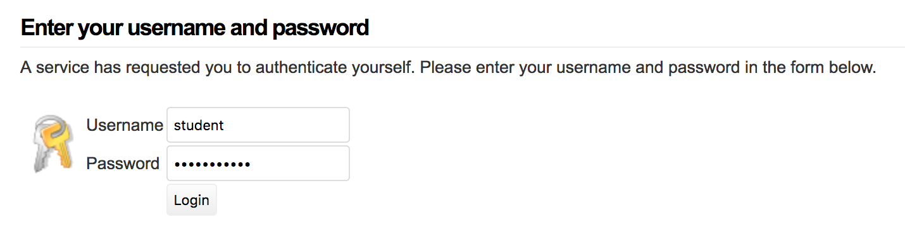

<!-- START doctoc generated TOC please keep comment here to allow auto update -->
<!-- DON'T EDIT THIS SECTION, INSTEAD RE-RUN doctoc TO UPDATE -->
**Table of Contents**  *generated with [DocToc](https://github.com/thlorenz/doctoc)*

- [Setting up an IdP](#setting-up-an-idp)
  - [Answers](#answers)
- [Run a container](#run-a-container)
- [Enable SSP as an IdP](#enable-ssp-as-an-idp)
  - [Changing config.php](#changing-configphp)
  - [Enable authsource](#enable-authsource)
  - [Changing saml20-idp-hosted.php](#changing-saml20-idp-hostedphp)
- [Metadata](#metadata)
  - [Register Metadata](#register-metadata)
  - [Log In](#log-in)
- [Summary](#summary)

<!-- END doctoc generated TOC please keep comment here to allow auto update -->


# Setting up an IdP

In this tutorial we are going to setup a SAML IdP and integrate it with some SPs

## Answers

We'll be using `idp` folder for the intial configuration and having you
adjust the files during the tutorial. The `idp-setup` folder contains configuration files that
have already been adjusted. You can reference those if you get stuck.


# Run a container

We are going to run a container for the service `https://idp.tutorial.stack-dev.cirrusidentity.com`
and mount some configuration files.

We also enable the `exampleauth` module by setting an environment
variable. The docker startup script will then ensure the module is enabled.

## macOS/Linux
```bash
cd <git checkout>
FOLDER=idp
docker run -d --name idp \
  -e VIRTUAL_PORT=443 \
  -e VIRTUAL_PROTO=https \
  -e VIRTUAL_HOST=idp.tutorial.stack-dev.cirrusidentity.com \
  -e SSP_ENABLED_MODULES='exampleauth' \
  -v $PWD/2_IdP_Setup/$FOLDER/config:/var/simplesamlphp/config \
  -v $PWD/2_IdP_Setup/$FOLDER/metadata:/var/simplesamlphp/metadata \
  -v $PWD/2_IdP_Setup/cert:/var/simplesamlphp/cert \
  cirrusid/ssp-base:1.14.16
```

##Windows
```bash
cd <git checkout>
set PWD=/c/Users/<current_user>/<path_to_tutorial_check_out>
set FOLDER=idp
docker run -d --name idp ^
  -e VIRTUAL_PORT=443 ^
  -e VIRTUAL_PROTO=https ^
  -e VIRTUAL_HOST=idp.tutorial.stack-dev.cirrusidentity.com ^
  -e SSP_ENABLED_MODULES='exampleauth' ^
  -v %PWD%/2_IdP_Setup/%FOLDER%/config:/var/simplesamlphp/config ^
  -v %PWD%/2_IdP_Setup/%FOLDER%/metadata:/var/simplesamlphp/metadata ^
  -v %PWD%/2_IdP_Setup/cert:/var/simplesamlphp/cert ^
  cirrusid/ssp-base:1.14.16
```

and you can now access the site

https://idp.tutorial.stack-dev.cirrusidentity.com/simplesaml/

and login as `admin/tutorial123`

# Enable SSP as an IdP

Now that we have an SSP running we'll configure it as an IdP.

The [SSP documentation](https://simplesamlphp.org/docs/stable) is fairly thorough. However to aid in creating a smooth tutorial we've already done several steps for you.

## Changing config.php

 `config.php` has already been updated to set thing like `adminpassword` and `secretsalt`. There are you few options you'll configure
to enable IdP functionality.

In your favorite editor edit `idp/config/config.php` and change 

* `enable.saml20-idp` to enable IdP functionality

Once you save, your changes are live. No need to restart anything

## Enable authsource

Users will need to authenticate to the IdP in some way. For the
tutorial purposes we'll have them authenticate using some
usernames/passwords pre-configured in `authsources.php`. In a real Idp
you would use one of the [provided Authentication
modules](https://simplesamlphp.org/docs/stable/simplesamlphp-idp#section_2),
or write your own.

Edit that file now and uncomment `tutorial-idp`. This will allow two users (`student` and `employee`) to authenticate with the passwords `sudentpass` and `employeepass`

```php
    'tutorial-idp' => array(
        'exampleauth:UserPass',
        // Format is  username:passwor => array( attributes )
        'student:studentpass' => array(
            'uid' => array('test'),
            'eduPersonAffiliation' => array('member', 'student'),
        ),
        'employee:employeepass' => array(
            'uid' => array('employee'),
            'eduPersonAffiliation' => array('member', 'employee'),
        ),
    ),
```

You can [test the authentcation source](https://idp.tutorial.stack-dev.cirrusidentity.com/simplesaml/module.php/core/authenticate.php) and confirm you can login.




## Changing saml20-idp-hosted.php

The `saml20-idp-hosted.php` contains the configuration for the IdP
that you are running. The `saml20-idp-remote.php` file we saw earlier
in the tutorial is used for IdPs you trust. Similarily the
`saml20-sp-remote.php` contains Service Providers you trust.

Edit the `saml2-idp-hosted.php` file and

* set `auth` to the name of the authsource you created earlier
* Enable sha256 for `signature.algorithm`
* Enable *uri NameFormat*  (the preferred option for `saml2int`) for attributes and `authproc` filter.

`authproc` filters are SSPs way to perform processing after
authentication occurs. This lets you do things like attribute mapping,
attribute release, etc. In this case it will map the friendly
attribute names we defined in `authsources.php` to the OID version of
those names. This mapping process is controlled by attribute maps. You
can run `docker exec -it idp head
/var/simplesamlphp/attributemap/name2oid.php` to get a sense of the
predefined maps.

 The `cert` folder already contains the SAML
signing keys for the IdP. This was done so the IdP metadata could be
pre-registered with some service providers.

# Metadata

If you are in the admin interface you can browse to [Federation
tab](https://idp.tutorial.stack-dev.cirrusidentity.com/simplesaml/module.php/core/frontpage_federation.php)
and see that there are two trusted SPs already configured and the metadata for your new IdP

The trusted SPs were preconfigured for this tutorial and the `php` metadata is in 
`idp/metadata/saml20-sp-remote.php`

## Register Metadata

Add the IdP metadata to the service provider you created earlier.

[View the IdP Metadata](https://idp.tutorial.stack-dev.cirrusidentity.com/simplesaml/saml2/idp/metadata.php?output=xhtml) and copy the `php` formated metadata from near the bottom
and add it to the SP from part 1 ( `1_SP_Setup/sp/metadata/saml20-idp-remote.php`)

## Log In

You can use your IdP to login.

* Tutorial SP.  [Test the SP's `default-sp` authsource](https://service.tutorial.stack-dev.cirrusidentity.com/simplesaml/module.php/core/authenticate.php?as=default-sp), pick your new IdP and authenticate as `student` or `employee`.
* Test Shib. [Visit the test Shib SP site](https://sp.testshib.org/) and enter `https://idp.tutorial.stack-dev.cirrusidentity.com/simplesaml/saml2/idp/metadata.php` for the entityId. 

# Summary

You've learned about setting up an IdP and `exampleauth`
In the next section you'll configure a Proxy.
