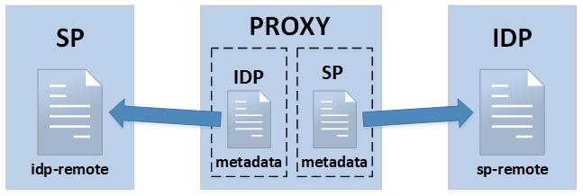

<!-- START doctoc generated TOC please keep comment here to allow auto update -->
<!-- DON'T EDIT THIS SECTION, INSTEAD RE-RUN doctoc TO UPDATE -->
**Table of Contents**  *generated with [DocToc](https://github.com/thlorenz/doctoc)*

- [Setting up a SAML Proxy](#setting-up-a-saml-proxy)
  - [Answers](#answers)
- [Run a container](#run-a-container)
  - [macOS/Linux](#macoslinux)
  - [Windows](#windows)
- [Combining SP and IdP](#combining-sp-and-idp)
- [Register metadata with an SP and an IdP](#register-metadata-with-an-sp-and-an-idp)
- [Authproc](#authproc)
- [Automated Metadata](#automated-metadata)
  - [Metadata Config](#metadata-config)
  - [cron config](#cron-config)
  - [config.php metadata sources](#configphp-metadata-sources)
  - [confirm metadata is available](#confirm-metadata-is-available)

<!-- END doctoc generated TOC please keep comment here to allow auto update -->


# Setting up a SAML Proxy

In this tutorial we are going to setup a SAML Proxy. A SAML Proxy is a
SAML Service Provider and SAML Identity Provider combined together. In
a proxy's simplest form, a regular SP will make an `authNRequest` to
the proxy, the proxy would then make an `authNRequest` to an upstream
IdP. The upstream IdP would respond with a signed SAML assertion. The
proxy would then create it's own assertion (based on data in the
upstream one), sign it and have the browser POST it the the original SP.

## Answers

We'll be using `proxy` folder for the intial configuration and having you
adjust the files during the tutorial. The `proxy-setup` folder contains configuration files that
have already been adjusted. You can reference those if you get stuck.


# Run a container

We are going to run a container for the service `https://proxy.tutorial.stack-dev.cirrusidentity.com`
and mount some configuration files.

We also enable the enable a few modules by setting an environment
variable. The docker startup script will then ensure the module is enabled.

## macOS/Linux
```bash
cd <git checkout>
FOLDER=proxy
docker run -d --name proxy \
  -e VIRTUAL_PORT=443 \
  -e VIRTUAL_PROTO=https \
  -e VIRTUAL_HOST=proxy.tutorial.stack-dev.cirrusidentity.com \
  -e SSP_ENABLED_MODULES='cron metarefresh' \
  -v $PWD/3_Proxy_Setup/$FOLDER/config:/var/simplesamlphp/config \
  -v $PWD/3_Proxy_Setup/$FOLDER/metadata:/var/simplesamlphp/metadata \
  -v $PWD/3_Proxy_Setup/cert:/var/simplesamlphp/cert \
  cirrusid/ssp-base:1.14.16
```
## Windows
```bash
cd <git checkout>
set PWD=/c/Users/<current_user>/<path_to_tutorial_check_out>
set FOLDER=proxy
docker run -d --name proxy ^
  -e VIRTUAL_PORT=443 ^
  -e VIRTUAL_PROTO=https ^
  -e VIRTUAL_HOST=proxy.tutorial.stack-dev.cirrusidentity.com ^
  -e SSP_ENABLED_MODULES="cron metarefresh authfacebook" ^
  -v %PWD%/3_Proxy_Setup/%FOLDER%/config:/var/simplesamlphp/config ^
  -v %PWD%/3_Proxy_Setup/%FOLDER%/metadata:/var/simplesamlphp/metadata ^
  -v %PWD%/3_Proxy_Setup/cert:/var/simplesamlphp/cert ^
  cirrusid/ssp-base:1.14.16
```

and you can now access the site

https://proxy.tutorial.stack-dev.cirrusidentity.com/simplesaml/

and login as `admin/tutorial123`

# Combining SP and IdP

If you visit the [federation
tab](https://proxy.tutorial.stack-dev.cirrusidentity.com/simplesaml/module.php/core/frontpage_federation.php)
in the SSP admin console you'll notice there is proxy metadata for an
`SP` and for an `IdP`. Both the `SP` and the `IdP` for the proxy are
configured in a similar fashion to `SP` and `IdP` you created earlier
in the tutorial.

To enable `proxy` mode you need to tie the `SP` and `IdP`
together. You can do this by editing the `IdP` metadata file and
setting the `auth` to the `authsource` name of the `SP`. Doing this
will tell the IdP to use the SP side for authentication.

<details>
  <summary>Need help setting <i>auth</i> value? Click to expand.</summary>
  <p>

The `IdP` configuration is in `3_Proxy_Setup/proxy/metadata/saml20-idp-hosted.php` and you want to set the `auth` value to the name of the SP's Auth source in `3_Proxy_Setup/proxy/config/authsources.php`. It should be `default-sp`

  </p>
</details>

# Register metadata with an SP and an IdP

To test out an authentication you'll need to register the proxy's SP metadata with the *IdP* (`https://idp.tutorial.stack-dev.cirrusidentity.com/`) we created earlier
and the proxy's IdP metadata with the *SP* (`https://service.tutorial.stack-dev.cirrusidentity.com/simplesaml/`) we created earlier. The following diagram illustrates what needs to be configured and the details are below. 
<p>

</p>

<details>
  <summary>Register SP metadata. Click to expand.</summary>
  <p>

1. View the [SP metadata](https://proxy.tutorial.stack-dev.cirrusidentity.com/simplesaml/module.php/saml/sp/metadata.php/default-sp?output=xhtml), scroll down and copy the `php` formatted metadata.
2. Edit the SP metadata file for the IdP from part 2 of the tutorial. Edit `2_IdP_Setup/idp/metadata/saml20-sp-remote.php` and paste in the metadata.

  </p>
</details>

<details>
  <summary>Register IdP metadata. Click to expand.</summary>
  <p>

1. View the [IdP metadata](https://proxy.tutorial.stack-dev.cirrusidentity.com/simplesaml/saml2/idp/metadata.php?output=xhtml), scroll down and copy the `php` formatted metadata.
2. Edit the IdP metadata file for the SP from part 1 of the tutorial. Edit `1_SP_Setup/sp-setup/metadata/saml20-idp-remote.php` and paste in the metadata.

  </p>
</details>


Now confirm it works by visiting the [test auth](https://service.tutorial.stack-dev.cirrusidentity.com/simplesaml/module.php/core/authenticate.php?as=default-sp) of the SP from part 1, and select the Proxy IdP. This will then make an `AuthNRequest` to the proxy, which will show its own discovery page (that looks identical). Pick the tutorial idp and authenticate. If everything was successful then you'll end up back on the original SP with some attributes displayed.

# Authproc

In this current setup the proxy doesn't provide a lot of value. The way to make it valuable depends on your use case, and it will probably involve using [authproc filters](https://simplesamlphp.org/docs/stable/simplesamlphp-authproc) to adjust what the proxy asserts.

Edit the `saml20-idp-hosted.php` file for the proxy and enable some authproc filters. Of course in you *real* production proxy you would adjust attributes for your use case.

```php
	'authproc' => array(
		// Convert LDAP names to oids.
		100 => array('class' => 'core:AttributeMap', 'name2oid'),
                150 => array(
                   'class' => 'core:AttributeAdd',
                   'favoriteFoods' => array('California Roll', 'Mission Burrito')
                ),
                160 => array(
                   'class' => 'core:AttributeCopy',
                   'urn:oid:0.9.2342.19200300.100.1.1' => 'duplicateUid',
                ),
	),
```

Now [test the authentication](https://service.tutorial.stack-dev.cirrusidentity.com/simplesaml/module.php/core/authenticate.php?as=default-sp) again. You may need click `Logout` at the bottom if you still have your previous session.

# Automated Metadata

We can also test the Proxy with Test Shib. If you recall from earlier, when visiting the [federation tab](https://proxy.tutorial.stack-dev.cirrusidentity.com/simplesaml/module.php/core/frontpage_federation.php) there was no metadata for test shib.

We'll use SSPs `metarefresh` module to [automatically pull and
validate](https://simplesamlphp.org/docs/stable/simplesamlphp-automated_metadata)
the metadata.  The `metarefresh` is triggered by the `cron` module to
periodically download metadata. These two modules are disabled by
default, however the docker command you ran earlier enabled them for
the proxy.

## Metadata Config

View `proxy-setup/config/config-metarefresh.php`. This is where you
configure where to pull external metadata from. In the below
configuration we are pulling the test shib metadata and caching it for
4 days. We'll store it in the `outputDir` which is relative to the
installation of SSP. The refresh job will run when the `cron` module
invokes the `hourly` hook. The Test Shib metadata is not signed so no
certificates are configured for validation.

```php
		'testshib' => array(
			'cron'		=> array('hourly'),
			'sources'	=> array(
				array(
					'src' => 'https://www.testshib.org/metadata/testshib-providers.xml',
				),
			),
			'expireAfter' 		=> 60*60*24*4, // Maximum 4 days cache time
			'outputDir' 	=> 'metadata/testshib/',

			/*
			 * Which output format the metadata should be saved as.
			 * Can be 'flatfile' or 'serialize'. 'flatfile' is the default.
			 */
			'outputFormat' => 'flatfile',
		),
```
## cron config

The `cron` module triggers periodic tasks to run. You can trigger the
hourly task by visiting the UI or by using `curl` (the next major
release will support cli invocation).

[Visit the cron UI
page](https://proxy.tutorial.stack-dev.cirrusidentity.com/simplesaml/module.php/cron/croninfo.php)
and click the `Run cron: [hourly]` link.

## config.php metadata sources

How does the rest of SSP know to look for metadata in the `outputDir` configured
for `metarefresh`?  In `config.php` look for the `metadata.sources`
setting. An additional directory has been added to tell SSP to look in
that `metadata/testshib` directory.

## confirm metadata is available

View the [federation
tab](https://proxy.tutorial.stack-dev.cirrusidentity.com/simplesaml/module.php/core/frontpage_federation.php)
and you should now see listings for both the SP and IdP Metadata for
TestShib.

As part of creating the tutorial we've pre-registered the Proxy
metadata with TestShib. You should be able to login to the [TestShib
SP](https://sp.testshib.org/) using the IdP `entityId`
`https://proxy.tutorial.example.org/idp`. **note** TestShib SP won't
print out the custom attributes the proxy adds.


