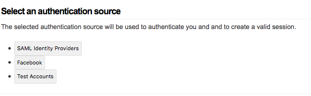

<!-- START doctoc generated TOC please keep comment here to allow auto update -->
<!-- DON'T EDIT THIS SECTION, INSTEAD RE-RUN doctoc TO UPDATE -->
**Table of Contents**  *generated with [DocToc](https://github.com/thlorenz/doctoc)*

- [Setting up a MultiProtocol Proxy](#setting-up-a-multiprotocol-proxy)
  - [Answers](#answers)
- [Run a container](#run-a-container)
  - [macOS/Linux](#macoslinux)
  - [Windows](#windows)
- [Adding New Authsources](#adding-new-authsources)
- [Make the Proxy IdP use multiple auth sources](#make-the-proxy-idp-use-multiple-auth-sources)

<!-- END doctoc generated TOC please keep comment here to allow auto update -->


# Setting up a MultiProtocol Proxy

In this tutorial we are going to setup a proxy that can speack
multiple protocols and translate those into SAML

## Answers

We'll be using `multi` folder for the intial configuration and having you
adjust the files during the tutorial. The `multi-setup` folder contains configuration files that
have already been adjusted. You can reference those if you get stuck.


# Run a container

We are going to run a container for the service `https://proxy.tutorial.stack-dev.cirrusidentity.com`
and mount some configuration files. This is the same `entityId`/hostname used earlier in the tutorial
so you'll need to shut down the previous docker container

    docker stop proxy

We also enable the enable a few modules by setting an environment
variable. The docker startup script will then ensure the module is enabled.

## macOS/Linux
```bash
cd <git checkout>
FOLDER=multi
docker run -d --name multi-proxy \
  -e VIRTUAL_PORT=443 \
  -e VIRTUAL_PROTO=https \
  -e VIRTUAL_HOST=proxy.tutorial.stack-dev.cirrusidentity.com \
  -e SSP_ENABLED_MODULES='cron metarefresh authfacebook exampleauth' \
  -v $PWD/4_MultiProtocol/$FOLDER/config:/var/simplesamlphp/config \
  -v $PWD/4_MultiProtocol/$FOLDER/metadata:/var/simplesamlphp/metadata \
  -v $PWD/4_MultiProtocol/cert:/var/simplesamlphp/cert \
  cirrusid/ssp-base:1.14.16
```

## Windows
```bash
cd <git checkout>
set PWD=/c/Users/<current_user>/<path_to_tutorial_check_out>
set FOLDER=multi
docker run -d --name multi-proxy ^
  -e VIRTUAL_PORT=443 ^
  -e VIRTUAL_PROTO=https ^
  -e VIRTUAL_HOST=proxy.tutorial.stack-dev.cirrusidentity.com ^
  -e SSP_ENABLED_MODULES="cron metarefresh authfacebook exampleauth" ^
  -v %PWD%/4_MultiProtocol/%FOLDER%/config:/var/simplesamlphp/config ^
  -v %PWD%/4_MultiProtocol/%FOLDER%/metadata:/var/simplesamlphp/metadata ^
  -v %PWD%/4_MultiProtocol/cert:/var/simplesamlphp/cert ^
  cirrusid/ssp-base:1.14.16
```

and you can now access the site

https://proxy.tutorial.stack-dev.cirrusidentity.com/simplesaml/

and login as `admin/tutorial123`

# Adding New Authsources

Add two new authsources: one for [facebook (search the linked doc for `facebook`)](https://github.com/simplesamlphp/simplesamlphp/blob/v1.14.16/config-templates/authsources.php) and one for [exampleauth](https://simplesamlphp.org/docs/stable/simplesamlphp-idp#section_3). Use `facebook` and `exampleauth` as the names of the authsources.

For `facebook` you can use the following, pre-registered information

* API key: 133972730583345
* API secret: e6f64db13ce933958b1cc175567f9a7c
* Test user email: techex_qclvvnr_user@tfbnw.net
* Test user password: `TacoTaco`

<details>
  <summary>Enable Facebook. Need a hint? Click to expand.</summary>
  <p>

1. Edit `multi/config/authsources.php`
2. Add a `facebook` authsource

```php
     'facebook' => array(
        'authfacebook:Facebook',
        'api_key' => '133972730583345',
        'secret' => '36aefb235314bad5df075363b79cbbcd',
    ),

```

3. Test the [facebook authentication](https://proxy.tutorial.stack-dev.cirrusidentity.com/simplesaml/module.php/core/authenticate.php?as=facebook)
  </p>
</details>

<details>
  <summary>Enable Exampleauth. Need a hint? Click to expand.</summary>
  <p>

1. Edit `multi/config/authsources.php`
2. Add an `exampleauth` authsource

```php
    'exampleauth' => array(
        'exampleauth:UserPass',
        // Format is  username:passwor => array( attributes )
        'student:studentpass' => array(
            'uid' => array('test'),
            'eduPersonAffiliation' => array('member', 'student'),
        ),
        'employee:employeepass' => array(
            'uid' => array('employee'),
            'eduPersonAffiliation' => array('member', 'employee'),
        ),
    ),

```

3. Test the [exampleauth authentication](https://proxy.tutorial.stack-dev.cirrusidentity.com/simplesaml/module.php/core/authenticate.php?as=exampleauth)

  </p>
</details>

# Make the Proxy IdP use multiple auth sources

The Proxy IdP configuration (in
`multi-setup/metadata/saml20-idp-hosted.php`) has its `auth`
configured to use the `default-sp` authsource. How can it be
configured to use multiple authsources? How does a user indicate which
one to use, if there are multiple?

The
[multiauth](https://simplesamlphp.org/docs/stable/multiauth:multiauth)
enables this functionality.  Review the `multiauth` documentation,
create an `authsource` called `multi` that can make use of the three existing
authsources and update the IdP to use it.

<details>
  <summary>Enable multiauth. Need a hint? Click to expand.</summary>
  <p>

1. Edit `multi/config/authsources.php`
2. Add an `multi` authsource

```php
    'multi' => array(
        'multiauth:MultiAuth',
        'sources' => array(
            'default-sp' => array(
                'text' => array(
                    'en' => 'SAML Identity Providers',
                ),
            ),
            'facebook' => array(
                'text' => array(
                    'en' => 'Facebook',
                ),
            ),
            'exampleauth' => array(
                'text' => array(
                    'en' => 'Test Accounts',
                ),
            ),
        ),
    )
```

3. Test the [multiauth authentication](https://proxy.tutorial.stack-dev.cirrusidentity.com/simplesaml/module.php/core/authenticate.php?as=multi)

You should see something like


4. Edit `multi/metadata/saml20-idp-hosted.php` and set `auth` to `multi`


  </p>
</details>

  

Once you have that complete you can visit the [test
SP](https://service.tutorial.stack-dev.cirrusidentity.com/simplesaml/module.php/core/authenticate.php?as=default-sp),
pick the Proxy IdP and then authenticate with Facebook. The proxy will
turn the Facebook attributes into SAML attributes, add the
`favoriteFoods` attribute we defined earlier and assert that back to
the SP. Did you notice the facebook attribute names are things like
`facebook.name` and `facebook.id` rather than the OID or LDAP friendly
names most SPs will expect? Try to add an [AuthProc filter](https://simplesamlphp.org/docs/stable/simplesamlphp-authproc#section_2) to change those attribute names


<details>
  <summary>Change Attribute Names. Need a hint? Click to expand.</summary>
  <p>

1. Edit `multi/metadata/saml20-idp-hosted.php` to add a new authproc filter.
2. [`core:AttributeMap`](https://simplesamlphp.org/docs/stable/core:authproc_attributemap) can perform mapping and it can make use of predefined maps in [SSP's attributemap folder](https://github.com/simplesamlphp/simplesamlphp/tree/master/attributemap)
3. Add `facebook2name`
```php
    'authproc' => array(
        // Convert Facebook names to oids.
        90 => array(
            'class' => 'core:AttributeMap',
            'facebook2name',
            //ID isn't defined in the map
            'facebook.id' => 'uid',
        ),

        // The rest of your authproc filters follow
    ),
```
4. Perform your login again

  </p>
</details>

## Virtual SSO Endpoints

Multiauth presents an auth discovery page to the user. If you, or the
SP know which `auth` mechanism to use you can by pass this discovery
using the `source=authname` query parameter.

For example on auth testing page, using
[`as=multi&source=exampleauth`](https://proxy.tutorial.stack-dev.cirrusidentity.com/simplesaml/module.php/core/authenticate.php?as=multi&source=exampleauth)
will tell the multiAuth module to choose exampleauth.

If your SP is using pair-wise federation (rather than a mesh
federation, such as InCommon) or has you manualy specify the
`SingleSignOnService` URL than you can add the source to that
URL.

You can test this out by editing the
`1_SP_Setup/sp-setup/metadata/saml20-idp-remote.php` file for service
provider created in part 1, and addding the `source` query parameter.
Be sure to edit the metadata for entity
`https://proxy.tutorial.example.org/idp`

```php

  'SingleSignOnService' => 
  array (
    0 => 
    array (
      'Binding' => 'urn:oasis:names:tc:SAML:2.0:bindings:HTTP-Redirect',
      'Location' => 'https://proxy.tutorial.stack-dev.cirrusidentity.com/simplesaml/saml2/idp/SSOService.php?source=facebook',
    ),
  ),
```

And now you can [test the SP's authentication
source](https://service.tutorial.stack-dev.cirrusidentity.com/simplesaml/module.php/core/authenticate.php?as=default-sp)
and verify the `multiauth` discovery is bypassed.

