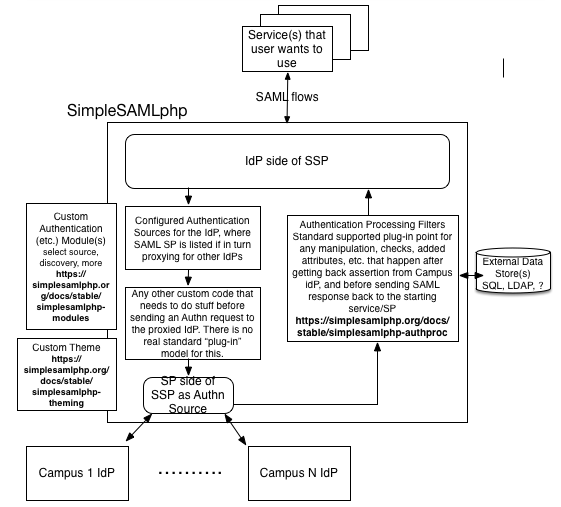

<!-- START doctoc generated TOC please keep comment here to allow auto update -->
<!-- DON'T EDIT THIS SECTION, INSTEAD RE-RUN doctoc TO UPDATE -->
**Table of Contents**  *generated with [DocToc](https://github.com/thlorenz/doctoc)*

- [Overview](#overview)
- [Protocol Bridge](#protocol-bridge)
- [Service Provider only supports single IdP](#service-provider-only-supports-single-idp)
- [Policy enforcement/Attribute Enrichment](#policy-enforcementattribute-enrichment)
- [Uniform IdP Interface](#uniform-idp-interface)
- [Hub and Spoke Federation](#hub-and-spoke-federation)
- [Adapter for non-federation friendly IDaaS providers](#adapter-for-non-federation-friendly-idaas-providers)
- [Account Linking](#account-linking)

<!-- END doctoc generated TOC please keep comment here to allow auto update -->

# Overview

A proxy provides you with lots of flebility in how authentication happens.

A basic example is this diagram form SURFNet that illustrates how several IdPs apppear as a single IdP to Google Apps

SSP provides several places where you can tie into the authentication process. Diagram from @mapgrady

 
# Protocol Bridge
 
Translate authentication between different protocols.
 
Example: Infrastructure relying on SimpleSAMLphp running since fall of 2014, as a bridge between OTT (over-the-top) streaming services (e.g. HBO Go) and colleges/universities running a variety of SSO/authentication protocols.
     https://www.unicon.net/about/news/unicon-completes-identity-and-access-management-services-campus-televideo

# Service Provider only supports single IdP

University systems using SimpleSAMLphp as an IdP Proxy for system-contracted services that only support a single IdP, but each member of the system has their own IdP.

# Policy enforcement/Attribute Enrichment

Proxy can enforce some additional "system-level policy", inject one or more additional attributes, perhaps add an additional level of authentication in some cases.

# Uniform IdP Interface

A proxy provide a "level playing field" to SP/services, a single IdP that supports a consistent set of SAML features regardless of a wide variety of SAML IdP technologies that the individual colleges might be running. Also, instead of new system-wide services needing to be independently integrated into each college IdP, the service can just be integrated into the Proxy, and become a new available service without a single config change in the individual college IdPs.

# Hub and Spoke Federation

Example: State-wide K-12 organization running SimpleSAMLphp to front varying authentication services across all the school districts in the state, providing a single authentication service to a variety of services and applications.

# Adapter for non-federation friendly IDaaS providers

IDaaS providers, such as Okta and Azure AD, usually have problems integrating with federations. A proxy can allow
the federations and IDaaS providers to operate together.

# Account Linking

A user may log in with one of several accounts and have the same persistent identifier asserted, regardless of the originating Idp.